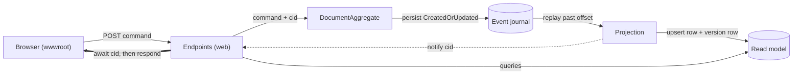
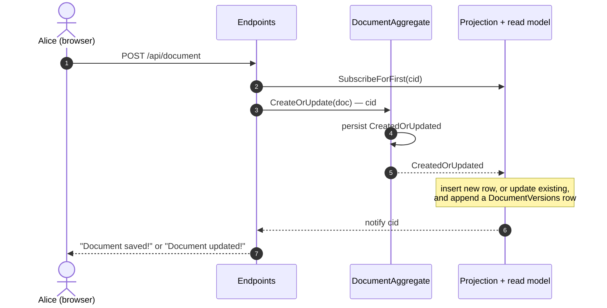
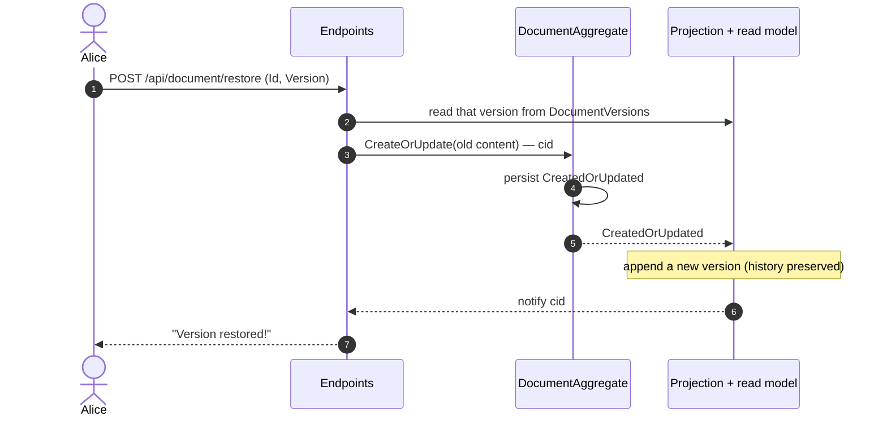

# focument — how it works (diagrams)

> **Baseline edition** — the event-sourced write side, a projected read model, and
> full version history. *No saga, no quota, no approval yet* — those arrive in the
> next step (the saga commit carries an extended version of this file).

These diagrams are derived from the actual `DocumentAggregate` and `Projection`
code. They render on GitHub and in VS Code's Mermaid preview, and can be imported
into Excalidraw (Insert → Mermaid) for a hand-drawn version.

The whole system is one idea: **commands are decided into events, events are the
source of truth, and a read model is projected from them.** A web request sends a
command, then reads its own write back off the projection.

---

## 1. Architecture / data flow

One aggregate, one event type. The web layer never reads aggregate state directly —
it sends a command, then reads its own write off the projected read model.

---

## 2. Creating or updating a document

The endpoint subscribes to the correlation id (`cid`) **before** sending the
command, then awaits the projected event — so the HTTP response only returns once
the read model reflects the write (read-your-writes).

A single `CreatedOrUpdated` fact covers both create and update; the projection
decides which by whether a row already exists. With no saga in the way, this event
is terminal — it's notified immediately, so the call returns as soon as the read
model has caught up.

---

## 3. Version history & restore

Every `CreatedOrUpdated` appends a row to `DocumentVersions`, so the full history is
kept. **Restore never rewrites history** — it re-issues the chosen version's content
as a fresh write, producing a new version on top.

---

> **Persist vs Defer.** `CreatedOrUpdated` is *persisted* — it's the fact, journaled
> and projected. The one *deferred* event is the wrong-id `Error`: it's published to
> subscribers but never journaled, because nothing actually happened to a document.
