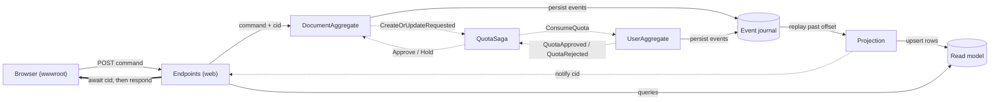
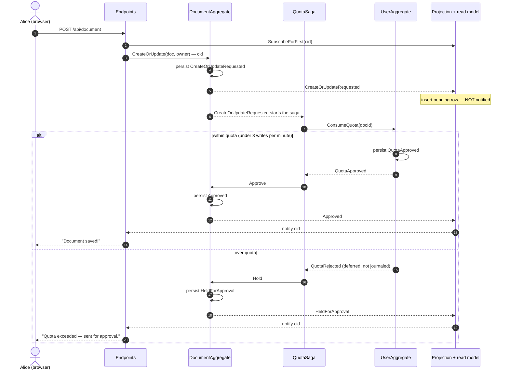
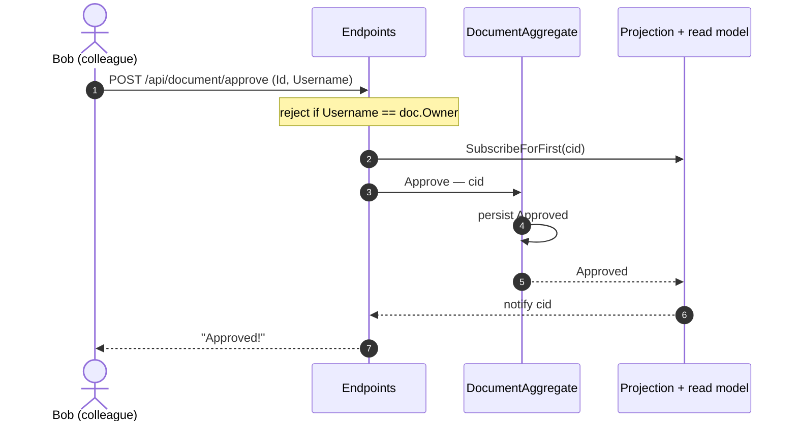
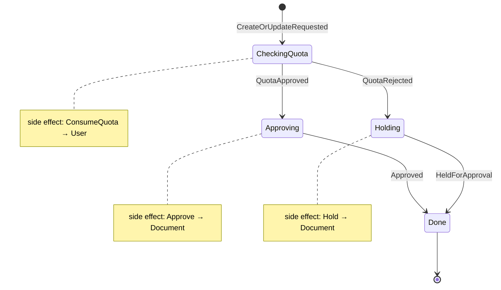

# focument — how it works (diagrams)

> **Saga edition** — the full workshop: the event-sourced write side, the read
> model, and the quota saga + colleague approval. The pre-saga **baseline** commit
> (`baseline-no-saga`) carries a trimmed version of this file.

These diagrams are derived from the actual `DocumentAggregate`, `UserAggregate`,
`QuotaSaga` and `Projection` code. They render on GitHub and in VS Code's Mermaid
preview, and can be imported into Excalidraw (Insert → Mermaid) if you want a
hand-drawn version for slides.

The whole system is one idea: **commands are decided into events, events are the
source of truth, and a read model is projected from them**. A saga coordinates the
two aggregates when a write needs a quota check.

---

## 1. Architecture / data flow

Solid arrows are the persisted command/event/projection path; dotted arrows are
the saga's message passing. The web layer never reads aggregate state directly —
it sends a command, then **reads its own write** off the projected read model
(see below).

---

## 2. Creating a document (the quota check)

The endpoint subscribes to the correlation id (`cid`) **before** sending the
command, then awaits the saga's terminal verdict. `CreateOrUpdateRequested` is
persisted (it starts the saga and writes a *pending* row) but is **not** notified —
so the HTTP call stays open until the document is actually Approved or Held.

> **Persist vs Defer.** `QuotaApproved` is *persisted* — it changes the user's
> consumed-slots state, so it must be journaled and replayable. `QuotaRejected` is
> *deferred* — it changes no state, but is still delivered to the saga so it can
> react. Deferred events reach sagas and subscribers but never hit the journal, so
> the projection (which reads the journal) never sees them.

---

## 3. Colleague approval

A *held* document is finalised by a **different** user — you can't approve your own.
This is a fresh request, with its own read-your-writes await.

---

## 4. QuotaSaga state machine

One saga instance per created document. It starts from the Document's
`CreateOrUpdateRequested`, asks the User to consume a slot, and tells the Document
the verdict. Each state has one side effect (the command it issues on entry).

The side-effect commands carry the `docId`, so the saga's at-least-once retries are
safe: re-issuing `ConsumeQuota` re-grants the same slot (the User is idempotent per
document), and re-issuing `Approve`/`Hold` is a no-op once the Document is already in
that state.
